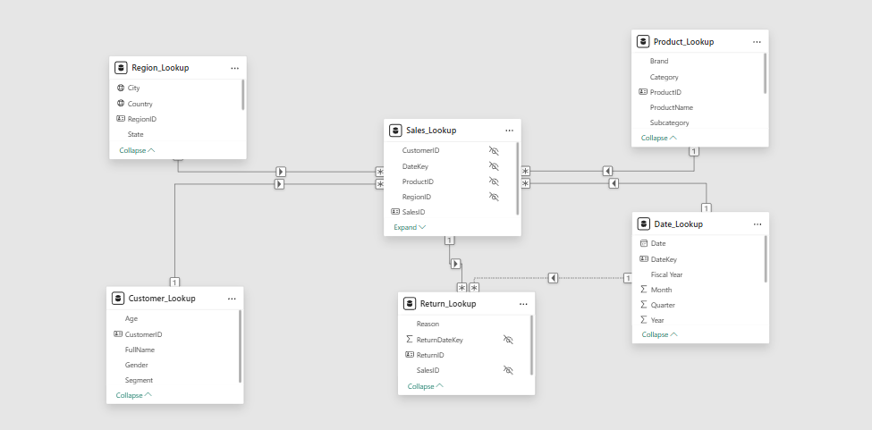
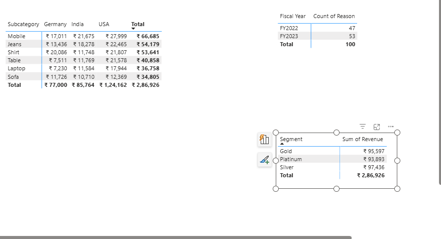

# 📊 Data Modeler — Normalized Star Schema (Power BI)

This project demonstrates the construction of a **relational star‑schema data model** in Power BI using multiple Excel‑based dimension and fact tables. The goal is to showcase understanding of:

- Table relationships
- Cardinality & cross‑filter directions
- Star vs. Snowflake modeling
- Handling inactive/ambiguous relationships
- Data categories & hierarchies
- Model View + Power Query logic

---

## 🔗 Relationship Types (Summary)

### **1️⃣ One-to-One (1:1)**
- One record in Table A matches **exactly one** record in Table B.
- Example: One employee → one ID card.

### **2️⃣ One-to-Many (1:M)**
- One record in Table A relates to **multiple** records in Table B.
- Example: One customer → many sales.

### **3️⃣ Many-to-One (M:1)**
- Same as 1:M but viewed from the other direction.
- Many sales rows → one product.

### **4️⃣ Many-to-Many (M:M)**
- Records in both tables can match multiple rows in each other.
- Example: Students ↔ Courses.
- Usually resolved using a **bridge table**.

---

## 📁 Dataset Overview

### 1. Sales_Fact.xlsx
- SalesID (PK)
- CustomerID (FK)
- ProductID (FK)
- RegionID (FK)
- DateKey (FK)
- Quantity
- Revenue
- Discount

### 2. Customer_Dim.xlsx
- CustomerID (PK)
- FullName
- Age
- Gender
- Segment

### 3. Product_Dim.xlsx
- ProductID (PK)
- ProductName
- Category
- Subcategory
- Brand

### 4. Region_Dim.xlsx
- RegionID (PK)
- Country
- State
- City

### 5. Date_Dim.xlsx
- DateKey (PK)
- Date
- Month
- Quarter
- Year
- Fiscal Year

### 6. Returns_Fact.xlsx
- ReturnID (PK)
- SalesID (FK → Sales_Fact)
- ReturnDateKey (FK → Date_Dim)
- Reason

---

## 📌 Project Tasks

### 1. Model Construction & Relationships

- Import all files using **Power Query**.
- Apply correct data types and remove blank rows.
- Load cleaned tables into the **Data Model**.
- Define **Primary Keys** and **Foreign Keys**.

#### Required Relationships:
- Sales_Fact → Customer_Dim
- Sales_Fact → Product_Dim
- Sales_Fact → Region_Dim
- Sales_Fact → Date_Dim
- Returns_Fact → Sales_Fact
- Returns_Fact → Date_Dim *(inactive relationship for ReturnDateKey)*

---

## 🗂 Data Model Preview

### ⭐ Star Schema Model Screenshot

---

## 📊 Report Preview Screenshots

### ✔ Sales Matrix, Returns Analysis & Segment Revenue

---

## ⚙️ Advanced Model Settings

- Set correct **cardinality** and **cross‑filter direction**.
- Use **bidirectional filters** only when needed.
- Keep ambiguous relationships under control.
- Use inactive relationships for scenario modeling.

---

## ✨ Data Model Enhancements

### ✔ Data Formatting
- Convert columns to correct data types (currency, whole numbers, dates).
- Set **Data Categories** (City, Country, ProductName).

### ✔ Build Hierarchies
- **Date_Dim:** Year → Quarter → Month → Date
- **Region_Dim:** Country → State → City
- **Product_Dim:** Category → Subcategory → ProductName

---

## 🧪 Verification Step

Use a **Matrix Table** to validate:
- Sales grouped by Product Category and Region
- Return reasons by Fiscal Year
- Revenue by Customer Segment

